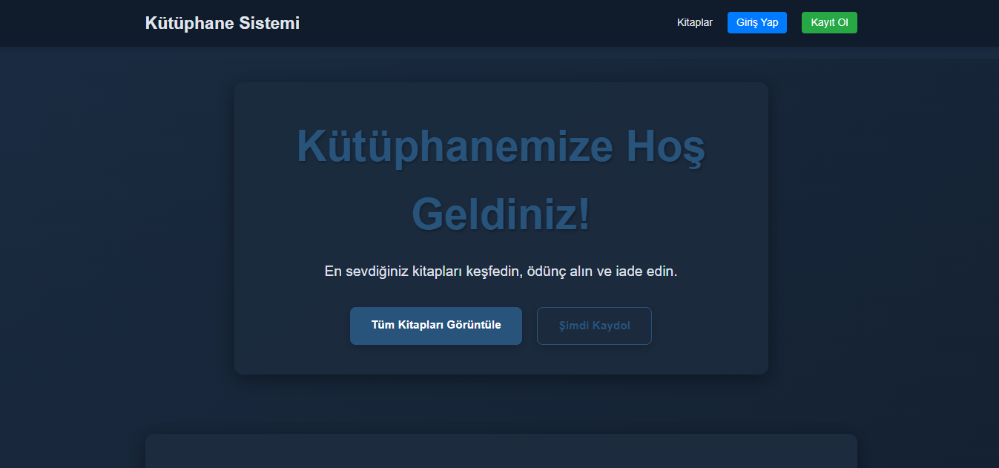
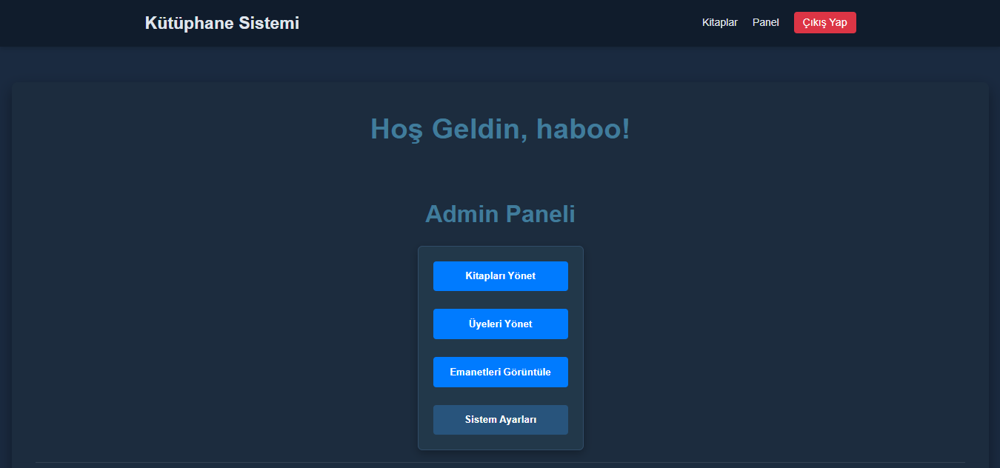
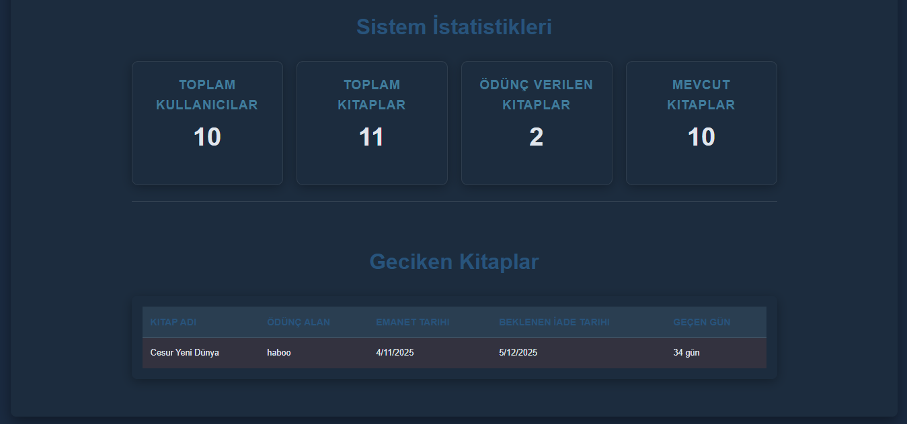
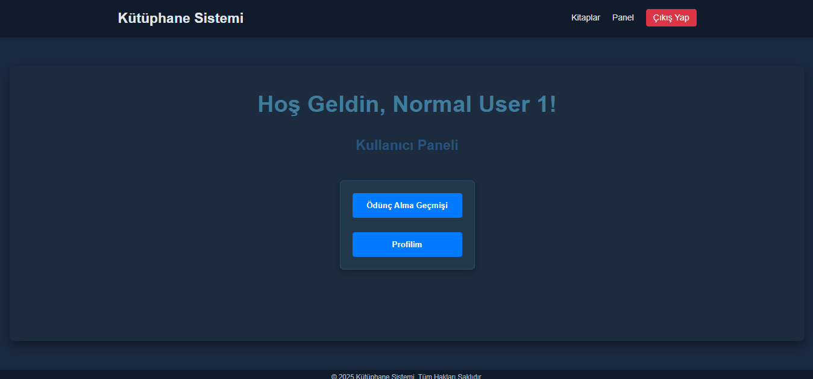
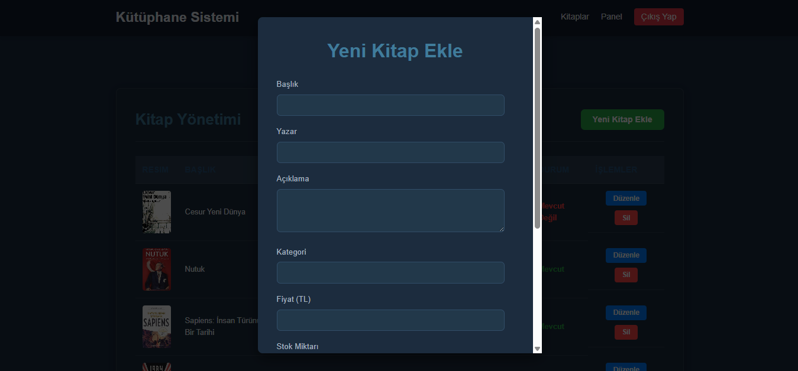

# 📚 Kutuphane Otomasyonu - Okul Projesi

[](#)   
[](LICENSE)   
[](#) 

> 🏫 Bu proje, [Fırat Üniversitesi](https://firat.edu.tr)  Bilgisayar Mühendisliği bölümü 3. sınıf öğrencisi **Mohammed Momtaz** tarafından *Yazılım Mühendisliği* dersi kapsamında geliştirilmiştir.



---

## 💡 Proje Nedir? 

Bu uygulama, küçük ve orta ölçekli kütüphanelerde kullanılabilecek basit ama etkili bir **kütüphane yönetim sistemi**dir. Öğrencilerin kitap ödünç almasını, iade etmesini, üyelerin yönetilmesini ve kitap envanterinin takibini sağlar.

---

## 🧰 Kullanılan Teknolojiler

| Katman     | Kullanılanlar                          |
|------------|----------------------------------------|
| Frontend   | HTML, CSS, JavaScript, React, Vite     |
| State      | Redux (Toolkit)                        |
| Backend    | Node.js, Express.js                    |
| Veritabanı | MongoDB (Mongoose ile)                 |
| Diğer      | Axios, JWT, dotenv, cors               |

---

## ✅ Temel Özellikler

- **📚 Kitap Yönetimi**
  - Yeni kitap ekleme
  - Mevcut kitabı güncelleme / silme
  - Kitap arama ve filtreleme

- **👤 Üye Yönetimi**
  - Üye kaydı ve giriş işlemleri
  - Üye bilgilerini görüntüleme ve düzenleme

- **🔄 Ödünç İşlemleri**
  - Kitap ödünç alma
  - Teslim tarihi takibi
  - Geç teslim durumu bildirimi

- **📊 Raporlama & İstatistik**
  - En çok okunan kitaplar
  - Aktif ödünc verilenler
  - Üye bazlı kitap sayısı

- **🎨 Responsive Arayüz**
  - Mobil cihazlara uyumlu tasarım
  - Kolay navigasyon

---

## 🖼️ Arayüz Görselleri (Örnek)

> 📸 Projenin bazı ekran görüntülerini buraya yerleştirerek daha profesyonel görünmesini sağlayabilirsin.

| Açıklama                  | Görsel                      |
|--------------------------|-----------------------------|
| Admin Paneli             |    |
| Admin Paneli 2           |    |
| Üye Paneli               |    |
| Kitap Ekleme Formu       |    |

---

## ▶️ Nasıl Çalıştırılır?

### 1. Repo'yu klonla:

```bash
git clone https://github.com/Mohammed-Momtaz/Kutuphane-Otomasyonu.git 
cd Kutuphane-Otomasyonu
```

### 2. Ortam değişkenlerini ayarla:

.env dosyasını oluştur:

```bash
MONGO_URI = mongodb://localhost:27017/
PORT = 4000
FRONTEND_URL = http://localhost:5173
SMTP_HOST = smtp.gmail.com
SMTP_PORT = 465
SMTP_MAIL = ** your email **
SMTP_PASSWORD = ** your password **
JWT_SECRET_KEY = ** jwt secret key **
JWT_EXPIRE = 7d
COOKIE_EXPIRE = 7
```

### 3. Gerekli bağımlılıkları yükle:

```bash
# Frontend
cd frontend
npm install

# Backend
cd ../backend
npm install
```

### 📬 İletişim
- GitHub: [Mohammed Momtaz](@Mohammed-Momtaz)
- E-posta: [Mohammed Momtaz Sharam](mohammedmomtazsharam@gmail.com)
- Okul: Fırat Üniversitesi – Bilgisayar Mühendisliği

### 🎉 Teşekkürler!
- Bu proje hem öğrenme sürecimin bir parçası hem de Web Teknolojileri dersimiz kapsamında sunduğum bir çalışmadır. Geri bildirimlerinizi ya da katkılarınızı memnuniyetle karşılarım!
